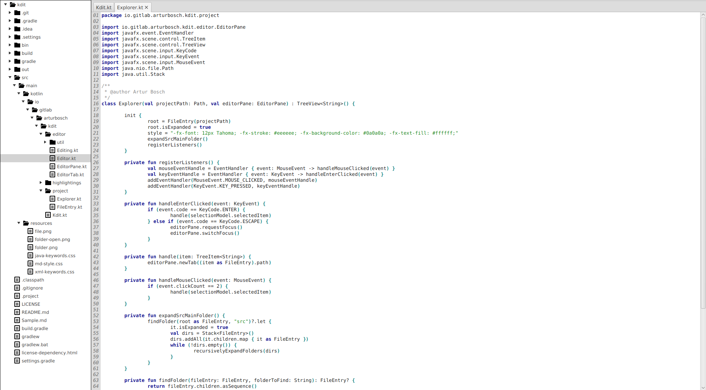

# kdit

A minimalistic shortkey-based text editor written in Kotlin and
powered by JavaFX. Supports syntax highlighting for Kotlin, Java, Groovy 
and for some elements of XML and Markdown. Uses _TornadoFX_ for easier
UI building and _RichTextFX_ for code areas.

## Shortkeys

ESC - Switch between tab pane and current tab  
Ctrl+Alt+Left - Switch to left tab  
Ctrl+Alt+Right - Switch to right tab  
Ctrl+T - New tab  
Ctrl+W - Close current tab  
Ctrl+H - Open a help tab  
Ctrl+E - Switch to project explorer if a project is open  

Ctrl+O - Open a file  
Ctrl+Shift+O - Open a project (Not supported yet)  
Ctrl+S - Save current file  
Ctrl+Shift+A - Save current file as ..  

Ctrl+K - Delete line  
Ctrl+D - Duplicate line  
Ctrl+/ - Comment/Uncomment current line  
Shift+Enter - Add newline not breaking current line  

Alt+Up - Move current line up  
Alt+Down - Move current line down  
Ctrl+Up - Navigate one paragraph up  
Ctrl+Down - Navigate one paragraph down  
Ctrl+Shift+Up - Navigate one page up  
Ctrl+Shift+Down - Navigate one page down  

## Build/Execution

Download jar from Bintray `https://bintray.com/arturbosch/software/kdit`
and run it with `java -jar kdit-xxx.jar`

or

Git clone this repository and run `gradle shadowJar` to create a 
executable jar. Again use `java -jar kdit-xxx.jar`.

It is highly recommend to create a shell script in /bin to start kdit from console.

## Credits

File and Folder icons are used from https://github.com/Keyamoon/IcoMoon-Free.
CodeArea component is from https://github.com/TomasMikula/RichTextFX

## Known Issues

- When using to many shortkeys manipulating text, the undo manager throws exceptions.